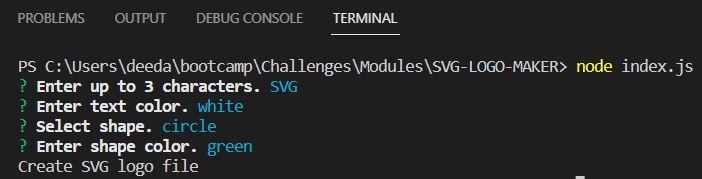
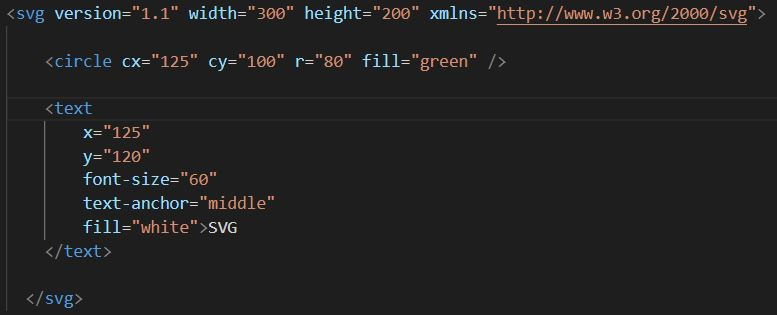
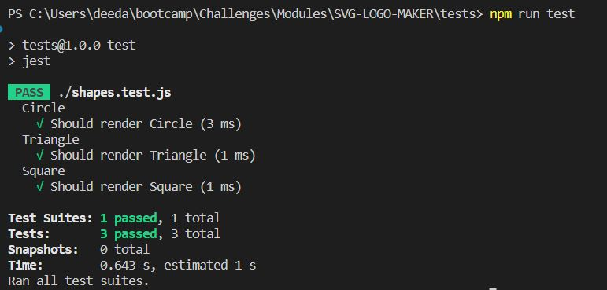

# SVG-LOGO-MAKER

## URL
N/A

## Description

This project is a SVG logo generator that creates a SVG logo file for the user based on inputs.
Using node, the user will select the following:
    Text: Choose up to 3 characters for the logo
    Text Color: Choose a text color (Hex Code or keyword)
    Shape: Circle, Triangle, or Square
    Shape Color: Choose a shape color (Hex Code or keyword)
The user's input will then create a SVG file of the logo.

## Summary

```
GIVEN a command-line application that accepts user input
WHEN I am prompted for text
THEN I can enter up to three characters
WHEN I am prompted for the text color
THEN I can enter a color keyword (OR a hexadecimal number)
WHEN I am prompted for a shape
THEN I am presented with a list of shapes to choose from: circle, triangle, and square
WHEN I am prompted for the shape's color
THEN I can enter a color keyword (OR a hexadecimal number)
WHEN I have entered input for all the prompts
THEN an SVG file is created named `logo.svg`
AND the output text "Generated logo.svg" is printed in the command line
WHEN I open the `logo.svg` file in a browser
THEN I am shown a 300x200 pixel image that matches the criteria I entered
```

## Installation

npm init -y
npm i inquirer@8.2.4
node index.js
npm install -g jest
npm run test

## Usage

This is a node.js file that creates a SVG file of a logo for the user based on the user input.

[SVG-LOGO-Maker-Walk-Through]()









## Credits

N/A

## License

Please refer to the LICENSE in the repo.